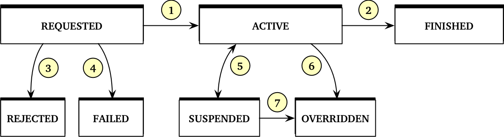

# *Charging Profiles* module *[PROPOSAL]*

**Module Identifier: `chargingprofiles`**

Charging Profiles control the rate of charging (in kW) during a charging session. It can mean that the entire charging session will be offered a constant power level, or it might mean that the power level is varied during the charging session. The most appealing use cases for Charging Profiles on public stations are electricity grid management and energy sector optimizations.

This section contains a more elaborate preamble than the more straightforward modules in this standard.

<em>

<h3 style="margin:0px">TO DO / Open Issues</h3>

This module is still in an early draft form, and should be revised to include the following items:

* Allow the eMSP to communicate the desired operating limits to the CPO. The driver may have certain demands on the minimum amount of energy to be transferred before a certain time. If the eMSP can communicate this by attaching this information to a Session object, the CPO may be able to take this into account when an aggregated Charging Profile is requested. Should be added to the Sessions object.
* Tariff information alongside the Charging Profiles, so that different Charging Profiles can be associated with different costs.
* Create transparency by including the initiator of a certain charging profile in the communication to the eMSP.
* Describe how Smart Charging providers might offer their services directly to a driver.
* Nice to have: Make arrangements for a Location to contain multiple Grid Connection IDs (or to provide a means to assign the Grid Connection ID to some other aggregate than a Location).
—> Allocatiepunten
* Nice to have: Add support for recurring Charging Profiles
* Indication of Flexibility added to Location objects
* Do we want to identify by Grid Connection ID or by Location ID?

</em>

 

<em>

<h3 style="margin:0px">Changes to other OCPI Modules</h3>
* Add DriverDemands to Session object
* Add EnergyInformation to Location object

</em>

### Roles and responsibilities

Whereas most of the OCPI standard assumes a pure and bilateral relation between the CPO and the eMSP, this module also recognizes the role of other actors that are involved in the value chain of electric mobility. Most notably, the grid operators and other actors on the energy market have a keen interest in the value that the flexibility of EV charging can provide.

The CPO now faces a decision of which external party may influence the charging behavior, and under which circumstances. A new role "Priviliged Actor" is introduced, which can be any party that the CPO deems 'privileged' to request Charging Profiles. Usually, this is a party that they have a contractual agreement with, such as56 Distribution System Operator (DSO).

- The **CPO** is always the gatekeeper to whether or not a Charging Profile is applied. They are the only party that can send the Charging Profile to the Charging Station. The CPO can actively offer Charging Profiles that the eMSP may select to use. It can also accept new requests for Charging Profiles from the eMSP or a Privileged Actor. It is also up to the CPO to provide the richt abstraction between the EV world and the broader energy world. This abstraction is described in this module.
- The **eMSP** is assumed to be the primary point of contact between the driver and the chargesession. Any information regarding Charging Profiles that are applied to a session are therefore communicated transparently to the eMSP so that this information can be relayed to the driver. The eMSP can also propose a Charging Profile to be applied to a single session.
- The **Privileged Actor (PA)** can send new Charging Profiles to be applied by the CPO. For most of the OCPI, the PA behaves like an eMSP with no customers. This actor cannot see the Session objects, but it can get the Location objects and their status updates. The PA can request new Charging Profiles to be applied to a Location. The CPO should manage the PAs for each Location and their merit order. The Privileged actors might be the local DSO, the TSO, and the BRP for the energy contract at the Location. It might also be an Aggregator that communicates to all these other parties and acts as the single PA on a Location.

### Charging Profile Intents

A Charging Profile always signals a certain *intent*. This intent is usually that the charging rate be limited during a certain period. It may also intend to allow the vehicle to charge faster than the default option. The intent may be to control the rate during certain hours of the day, or to control the rate at a time relative to the current time (e.g. for realtime grid management operations). This module attempts to allow the communication of those intents.

The following variations are available for Charging Profiles in OCPI:

* Start Time
    * At a specific date and time. Useful to pinpoint the full date and time that a Charging Profile starts.
    * At a specific time within the next 24 hours. Useful for generic services that control the charging rate at a specific time of day.
    * As soon as possible. Useful for near-time or real-time operations.
* Power Level
    * Absolute Maximum in kW. This is useful if the intent is to control the power or energy to a specific desired value.
    * Relative Adjustment in kW. This is useful if the intent is to adjust the power level with respect to what is happing *right now* on a congestion point. The requestor of the flexibility may not be interested in the absolute levels of power that is available to a Session or Location. Note that there is no reasonable expectation to reliably be able to *raise* the power level, only to *reduce* it.
* Power Target
    * Total Power. This is useful for BRP and TSO related Smart Charging operations where the total energy during a time period is to be controlled.
    * Per-phase power. This is useful for DSO-related Smart Charging operations where the total current per phase is to be limited to the maximum allowable value for the connection or backhaul.
* Target
    * Single *Session*
    * Single *Location*

It is the responsibility of the CPO to translate these intents into per-Session Charging Profiles that will achieve the desired result on the intended aggregation level (or return a `FAILED` status if it is deemed impossible). Some of the intelligence can be handled by the Charging Stations today, some of it may be handled by the stations in some future updates, but there will always be part of the operations that must happen on the CPO system.

#### Caveats

1. Charging Profiles always define an **upper limit** to the Charging Rate at a particular time period. A minimum charging rate can never be guaranteed by using a Charging Profile, simply because it the vehicle controls the minimum charging rate
2. In the near future, the PA has no reasonable right to expect that the intention can be fully fulfilled. Some parameters are simply out of the CPO's hands and in other situations it may wish to withhold some flexibility if it deems the request to be too disruptive to the driver.
3. OCPI Charging Profiles are simply a means to achieve certain behavior. The obligation of the CPO to comply always comes from (legal) agreements between the parties involved.

### Identification of assets

Actors in the energy sector usually have a nationally agreed-upon way to identify assets. Some examples:

* Germany and Austria use a 33-position *[Zählpunktbezeichnung](https://de.wikipedia.org/wiki/Zählpunkt)*
* The Netherlands and Belgium use an 18-digit *EAN Code*
* Great Britain uses a 21 position *[Meter Point Administration Number (MPAN)](https://en.wikipedia.org/wiki/Meter_Point_Administration_Number)*
* Spain uses a 20-22 position *[Código Unificado de Punto de Suministro](https://es.wikipedia.org/wiki/Código_Unificado_de_Punto_de_Suministro)*
* France uses a 14-position *Point de Livraison*

These identifications will be referred to in this document as the Grid Connection ID.

These are usually linked to a single Location in OCPI parlance, although the EVSEs may not be the only connected objects at that point. In order to facilitate the identification of assets, the Locations module contains a field for the Grid Connection ID. Since they are not necessarily unique across country borders, and since a CPO may operate internationally, looking up the Location ID from the Grid Connection ID should always include a check on the Country Code in the Location object. Identification of the Location on the CPO system is always done using the Location ID, not the Grid Connection ID.

### Monitoring energy use

In order to perform grid management operations, some form of anonymized monitoring must be available to the PA. The PA is not interested in (nor allowed to see) the personal information of the charging sessions (and hence will not receive the Sessions objects).

The Locations object is extended with energy usage properties that can deliver information like actual power use, per-phase power use, et cetera. The PA receives the Location objects and their updates.

### Templates and Instances

A charging profile is only effective once it is applied to a Session. However, certain Charging Profiles may be reusable in the future. For this reason, there are two separate objects: a Charging Profile Template and a Charging Profile Instance. This way, the Templates can be offered or supplied in advance, and be available, while the actual state of a Charging Profile on a Session can be monitored in a separate, new object (an Instance).

### Transparency and Communication

Applying Charging Profiles to a Session will alter the expected behavior of the Charging Station to the driver. It is of paramount importance to inform the driver of what is happening to their charging session. This is the responsibility of the eMSP, as they have a direct relationship with the customer. Any Charging Profiles that are applied to Sessions, regardless of the initiator, will be communicated through the eMSP.

### Requirements

In order to supply flexibility services to the electricity grid, the CPO must have some things in order.

1. The *Location* must include a Grid Connection ID that the PA can use to look up the correct Location.
2. The CPO must collect power measurements from the Charging Stations (or must derive them from the reported kWh measurements).
3. The CPO must be able to reliably add the measurements together report aggregate information on multiple EVSEs at a single Location. Ideally, per-phase measurements must be taken and the measurements at the phases must be correctly added together.
4. The CPO must be able to receive an aggregate Charging Profile Request, which may be targeted at the sum of multiple EVSEs, and be able to create separate, per-session or per-EVSE charging profiles that are applied to the running sessions. This leaves some freedom to the CPO to determine how to exactly control the assets. It also places a burden on the CPO in that these Charging Profiles are not 1:1 mappable to the OCPP Charging Profiles.

Locations that cannot meet the above standards should not include the missing information in their Location Objects and/or should be excluded from handling Charging Profiles (status `FAILED` for any requests made to this Location). It is up to the CPO to decide whether to offer Charging Profiles capability on their Locations.

### Module Dependencies

The use of the Charging Profiles module requires at least the `Locations` module and (on the eMSP side) the `Tariffs` module to be implemented.

## 1. Flow and Lifecycle

The lifecycle of Charging Profiles is as follows:

1. A Charging Profile Template is created. This can be initiated by the PA, CPO and eMSP using a `PUT` request.
2. The CPO will attach a Tariff to the Charging Profile Template and `PATCH` the object accordingly.
3. The Charging Profile is activated. This can be initiated by the PA and eMSP using a `POST` request. This creates a new ChargingProfileInstance object that the CPO pushes to the initiating party.
4. The Charging Profile Request may be either Rejected or Accepted, reaching a Rejected or Active state, respectively.
5. The CPO will execute the Charging Profile on the relevant EVSE(s).
6. The Charging Profile MAY be overridden by some higher-priority Charging Profile that is requested after the previous Charging Profile has been activated.
7. After the Charging Profile's duration, the Charging Profile is updated one last time with the status FINISHED.

The step of creating the Charging Profile Template may be done well in advance. The CPO could create several Charging Profiles that are offered to the PA and eMSP.

The Charging Profile can be made by either the PA, eMSP or the CPO, but updates and status changes are always in the hands of a CPO. It is not possible to update the contents of a Charging Profile. Instead, a new Charging Profile will have to be requested that overrides the previous one.

### 1.1 Creating Charging Profile Templates

Charging Profiles can either target a single *Session*, but it can also target a *Location*. Session-related Charging Profiles are the closest representation of the actual (OCPP) Charging Profile that is to be activated on a station, while Location-related Charging Profiles are aggregated profiles that are useful to players in the energy system (the Privileged Actors).

A *Session*-related Charging Profile may be created in one of two ways:

1. The eMSP can create the Charging Profile for a *Session*. This object is created by the eMSP and `PUT` to the CPO. The Charging Profile is identified on the CPO system by the eMSP's Country Code, Party Id and eMSP-generated Charging Profile ID. On the eMSP system, it is only identified by the Charging Profile ID.
2. The CPO can create the Charging Profile Template for a *Session*. This object is created by the CPO and `PUT` to the eMSP. On the CPO system, this Charging Profile is identified by a CPO-generated Charging Profile ID, on the eMSP system it is identified by the CPO's Country Code, Party ID and the Charging Profile ID.

A *Location*-related Charging Profile Template can be created by the PA or the CPO:

1. The CPO can create Charging Profile Templates to offer to the PA for selecting.
2. The PA can create a new Charging Profile Template on the CPO system to use at a later time.

### 1.2 Attaching Tariff information to the Charging Profile Template

(to be defined)

### 1.3 Activating Charging Profiles

To request a Charging Profile Template to be applied to a certain target, the PA or eMSP use a `POST` request on the ChargingProfileRequest endpoint.

Parameters:

* Charging Profile ID
* Target ID (SessionID or LocationID)

If the CPO deems it possible to execute this request, the CPO creates a new ChargingProfileInstance object with its own ID. This new object is `PUT` to the requesting party and is updated through the `PATCH` method.

If the request was to activate a *Location*-related profile, CPO not only creates a new ChargingProfileInstance on the PA system, but also a ChargingProfileInstance on the eMSP system(s) for each of the running sessions, containing the actual charging profile that is applied to that Session.

### 1.4 Updates during the lifetime of the ChargingProfileInstance

The following state transitions are possible:

1. **Requested** to **Active**. The CPO has been able to create Session Charging Profile Instances that lead to the requested behavior. These charging profiles are now active on the relevant sessions.
2. **Active** to **Finished**. The Charging Profile has reached the end of its duration and 'normal' charging is resumed.
3. **Requested** to **Rejected**. This state transition occurs when the CPO does not even try to apply the charging profiles to the sessions. Reasons include:
    * The CPO deems that the requesting party does not have the privilege to make this request;
    * A different, higher-ranked charging profile is already active on the target.
    * The demand is deemed unreasonable: the charging profiles required to follow this request would be impossible or undesirable.
4. **Requested** to **Failed**. The CPO has tried to apply the Charging Schedules to the sessions but could not do it due to circumstantial reasons. In other words: attempting this at a later time might work. Reasons include:
    * The Charging Station(s) is/are unreachable.
    * The Charging Station(s) rejected the charging profile.
5. **Active** to **Suspended**. The Active Charging Profile has been suspended because a different charging profile temporarily takes precedence. This new charging profile ends before the original charging profile would have ended. After the new charging profile ends, this profile will be resumed.
6. **Active** to **Overridden**. A different, higher-ranked charging profile is activated on the same target that lasts beyond the end of the current charging profile.
7. **Suspended** to **Overridden**. The charging profile that was in a suspended state has been overridden by a new charging profile that lasts beyond the end of the suspended charging profile.

All states except Requested, Active and Suspended are *final*.

Several use case examples are presented in section 1.7.

### 1.5 Translating Location-related Charging Profiles to Session-related Charging Profiles

*Note: There is a separate white paper for CPO guidance on this subject that is distributed alongside this specification document. The focus of this document is on the message events that occur during this phase.*

Upon receiving a request for activation of a Location-profile, the CPO will create one or more Session-profiles to reach the desired outcome.

### 1.6 Cancelling or updating a Charging Profile

It is not possible to update a Charging Profile instance. The method to achieve the same behavior is to request a different Charging Profile to be activated. To cancel a Charging Profile Instance, the default template should be requested to be activated.

### 1.7 Examples

There are a number of practical use cases for the Charging Profiles module. This section presents the following:

1. The eMSP activates a fast-charging Charging Profile for a single session.
2. The PA wishes to limit the charging rate for realtime capacity management during the next two hours.
3. The PA wishes to limit the charging rate for realtime capacity management while a different charging profile is already active.
4. One PA wishes to decrease the charging rate for realtime FCR purposes while a different PA profile is already active for capacity management.
5. A Charging Profile is active at the moment a Session is ended, leaving no other sessions at that Location.
6. A Charging Profile is active at the moment a Session is ended, leaving other sessions at that Location.
7. A PA wishes to control the maximum amount of energy that is charged during a 15-minute interval at a certain Location.

#### 1.7.1: eMSP selects a fast-charging Charging Profile for a single session.

In this example, the CPO offers a Charging Profile Template that offers a higher-than-normal power level, for example:

#### 1.7.2: The PA wishes to limit the charging rate for realtime capacity management during the next two hours.

Let's assume the DSO has agreed with the CPO that they can control the charging rate during peak hours or emergencies. The DSO measures that a transformer or supply cable has crossed its maximum capacity and, based on predictions, wishes to lower the charging current on a location by some number of kW for the next 30 minutes.

The DSO sees that no predefined Charging Profile Templates are available from the CPO.

The DSO decides to define a new Charging Profile Template that looks like this:

    {
        "id": "12345",
        "target_type": "LOCATION",
        "start_type": "NOW",
        "adjustment_intent": "RELATIVE",
        "max_power_intent": "PER_PHASE",
        "schedule":
            [{
              "duration": 1800,
              "power": -2
            }]
    }

The DSO then follows this up with a request for activation:

    {
        "target": "NL-EVN-001",
        "profile_id": "12345"
    }

The CPO returns a new [ChargingProfileInstance][3.2chargingprofileinstanceobject] object, adjusted to the current conditions:

    {
        "id": "34567",
        "target_type": "LOCATION",
        "target_id": "NL-EVN-LOC001"
        "start_type": "DATETIME",
        "start": "2017-06-01T17:30:00",
        "adjustment_intent": "RELATIVE",
        "max_power_intent": "PER_PHASE",
        "schedule":
            [{
                "duration": 1800,
                "power": -2
            }],
        "status": "PENDING"
    }

The CPO then creates separate Session-related charging profiles for each running session, that together create the desired result, for example:

    {
        "id": "34568",
        "target_type": "SESSION",
        "target_id": "NL-EVN-12345678",
        "start_type": "DATETIME",
        "start": "2017-06-01T17:30:00",
        "max_power_intent": "PER_PHASE",
        "adjustment_type": "ABSOLUTE",
        "schedule":
            [{
                "duration": 1800,
                "power": 2.7
            }],
        "status": "ACTIVE"
    }

The CPO will then `PATCH` the ChargingProfileInstance on the DSO system:

    {
        "status": "ACTIVE",
        "last_updated": "2017-06-01T17:30:10"
    }

After the profile has ended, all ChargingProfileInstance objects are updated with the status "FINISHED":

    {
        "status": "FINISHED",
        "last_updated": "2017-06-01:T18:00:00"
    }

In the future, the DSO can simply activate the Charging Profile Template they created on the CPO system by calling the POST method again:

    {
        "target": "NL-EVN-LOC001",
        "profile_id": "12345"
    }

This template can also be used on a different Location:

    {
        "target": "NL-EVN-LOC002",
        "profile_id": "12345"
    }

For the DSO, this is a pretty lightweight system to communicate their intent to the CPO. The CPO can (if so desired) pre-calculate the possible Charging Schedules for each Template so that the response time can be optimized.

#### 1.7.3: The PA wishes to limit the charging rate for realtime capacity management while a different charging profile is already active.

(to be appended)

#### 1.7.4: One PA wishes to decrease the charging rate for realtime FCR purposes while a different PA profile is already active for capacity management.

(to be appended)

#### 1.7.5: A Charging Profile is active at the moment a Session is ended, leaving no other sessions at that Location.

Since a Charging Profile can only ever signal the intent to charge at a certain maximum rate, the fact that no more sessions are active at this Location is irrelevant to the Profile. The profile will remain active, being applied to any new sessions that might start before the profile finishes.

(to be appended)

#### 1.7.6: A Charging Profile is active at the moment a Session is ended, leaving other sessions at that Location.

The stopping of one Session might lead to other sessions being given more available power. The CPO will re-calculate the possible Session Profiles and apply them accordingly.

(to be appended)

#### 1.7.7: A PA wishes to control the maximum amount of energy that is charged during a 15-minute interval at a certain Location.

The PA will use a "Total Power" profile instead of a "Per Phase" profile.

(to be appended)

## 2. Interfaces and Endpoints

(under construction)

### 2.1 CPO

| Method                   | Description                                          |
| ------------------------ | ---------------------------------------------------- |
| [GET](#211-get-method)   | Fetch the available Charging Profiles for a Location |
| [POST](#212-post-method) | Request some Charging Profile to be activated        |
| [PUT](#213-put-method)   | Send new Charging Profile to the CPO                 |
| PATCH                    | n/a                                                  |
| DELETE                   | n/a                                                  |

#### 2.1.1 GET method

Using the GET method, the PA or eMSP can retrieve a list of all Charging Profile Templates.

#### 2.1.2 PUT method

Using the PUT method, a PA or eMSP can create a new Charging Profile in the CPO system.

#### 2.1.3 POST method

Using the POST method, the PA or eMSP can request to activate a Charging Profile.

### 2.2 eMSP

#### 2.2.1 PUT method

The CPO can announce a Charging Profile Template to the eMSP by using the PUT method.

Example Endpoint structure: `/ocpi/2.2/emsp/chargingprofiles/{country_code}/{party_id}`.

##### Request Parameters

| Parameter     | Datatype                              | Required | Description                                                    |
|---------------|---------------------------------------|----------|----------------------------------------------------------------|
| country_code  | [string](types.md#15-string-type)(2)  | yes      | Country code of the CPO requesting this PUT to the eMSP system |
| party_id      | [string](types.md#15-string-type)(3)  | yes      | Party ID of the CPO requesting this PUT to the eMSP system     |

##### Request Body

| Type                                            | Card. | Description                      |
|-------------------------------------------------|-------|----------------------------------|
| [ChargingProfile](#31-chargingprofile-object)   | 1     | Complete Charging Profile object |

#### 2.2.2 PATCH method

The CPO can use the PATCH method to update either a ChargingProfileTemplate or ChargingProfileInstance object.

(*to be revised*)

##### Request Parameters

| Parameter     | Datatype                              | Required | Description                                                    |
|---------------|---------------------------------------|----------|----------------------------------------------------------------|
| country_code  | [string](types.md#15-string-type)(2)  | yes      | Country code of the CPO requesting this PUT to the eMSP system |
| party_id      | [string](types.md#15-string-type)(3)  | yes      | Party ID of the CPO requesting this PUT to the eMSP system     |

##### Request Body

| Type                                            | Card. | Description                      |
|-------------------------------------------------|-------|----------------------------------|
| [ChargingProfile](#31-chargingprofile-object)   | 1     | Partial Charging Profile object  |

### 2.3 Privileged Actor

The privileged actor should implement the following endpoints.

Endpoint `/ocpi/pa/2.2/chargingprofiles/template`:

| Method                     | Description                                          |
| -------------------------- | ---------------------------------------------------- |
| GET                        | n/a                                                  |
| POST                       | n/a                                                  |
| [PUT](#213-put-method)     | Send new Charging Profile Templates to the PA        |
| [PATCH](#214-patch-method) | Update the status of a Charging Profile Template     |
| DELETE                     | n/a                                                  |

Endpoint `/ocpi/pa/2.2/chargingprofiles/instancestatus_allstatus_all`:

| Method                       | Description                                          |
| ---------------------------- | ---------------------------------------------------- |
| GET                          | n/a                                                  |
| POST                         | n/a                                                  |
| [PUT](#213-put-method)       | Send new Charging Profile Instances to the PA        |
| [PATCH](#214-patch-method)   | Update the status of a Charging Profile Instance     |
| [DELETE](#234-delete-method) | Delete Charging Profile Template                     |

(*to be revised*)

#### PATCH method

The CPO can PATCH an existing Charging Profile to update its status.

`PATCH` request to the `/ocpi/2.2/pa/chargeprofiles/{chargeprofile_id}`

##### Request Parameters

| Parameter         | Datatype                              | Required | Description                                         |
|-------------------|---------------------------------------|----------|-----------------------------------------------------|
| chargeprofile_id  | [string](types.md#15-string-type)(15) | yes      | ChargingProfile.id of the targeted Charging Profile |

##### Request Body

| Type                                            | Card. | Description                     |
|-------------------------------------------------|-------|---------------------------------|
| [ChargingProfile](#31-chargingprofile-object)   | 1     | Partial Charging Profile object |

(*to be revised*)

## 3. Object description

### 3.1 *ChargingProfileTemplate* Object

| Field Name       | Type                          | Card. | Description                                                                                                   |
|--------------------------------------------------------------------------------------------------------------------------------------------------------------------------|
| id			    | integer				        | 1     |                                                                                                               |
| reason            | string(255)                   | 1     | The reason for the Charging Profile that can be communicated to the driver for transparency.                  |
| target_type       | ChargingScheduleTargetType    | 1     | Points to the object type that the schedule should apply to                                                   |
| target_id         | string(39)                    | 1     | The ID of the target. Can be the Location ID, EVSE ID or Session ID                                           |
| start_type        | StartTimeType                 | 1     |                                                                                                               |
| schedule_start    | datetime                      | ?     | The time at which this schedule should start. If not supplied by the requesting party, it is set to requested |
| adjustment_intent | AdjustmentIntent              | 1     | Whether adjustments are absolute or relative.                                                                 |
| max_power_intent  | MaxPowerIntent                | 1     | The intent of the MaxPower in the.                                                                            |
| schedule          | SchedulePeriod                | +     | The periods of the charging schedule                                                                          |
| status            | ChargingScheduleStatus        | 1     | The current state of this charging schedule                                                                   |
| requested         | datetime                      | 1     | The date and time at which this profile was requested                                                         |
| last_updated      | datetime                      | 1     | The date and time this ChargingProfile was last updated                                                       |

####  3.1.1 Example

    {
        "id": "1234567890",
        "target_type": "LOCATION",
        "target_id": "NL-ARNHEM-001",
        "schedule_start": "2017-05-01T13:30:00Z",
        "schedule": [{"max_power": 10,
                      "duration": 300},
                      {"max_power": 5,
                       "duration": 300}
                       ]
        "status": "ACTIVE",
        "requested": "2017-05-01T13:25:00Z"
        "last_updated": "2017-05-01T13:35:00Z",
    }

The fields `status`, `requested` and `last_updated` will only be writable by the CPO using `PATCH` requests. Any data present in the request during the `PUT` SHALL be ignored by the CPO and SHOULD NOT be included in the object.

(*to be revised*)

### 3.2 *ChargingProfileInstance* object

| Field Name        | Type                           | Card. | Description                                                                                                   |
|----------------------------------------------------------------------------------------------------------------------------------------------------------------------------|
| id			    | integer				         | 1     |                                                                                                               |
| template_id       | integer                        | ?     | The ChargingProfileTemplate ID that this is an instance of, if any                                            |
| reason            | string(255)                    | 1     | The reason for the Charging Profile that can be communicated to the driver for transparency.                  |
| target_type       | ChargingScheduleTargetType     | 1     | Points to the object type that the schedule should apply to                                                   |
| target_id         | string(39)                     | 1     | The ID of the target. Can be the Location ID, EVSE ID or Session ID                                           |
| schedule_start    | datetime                       | ?     | The time at which this schedule is started.                                                                   |
| adjustment_intent | AdjustmentIntent               | 1     | Whether adjustments are absolute or relative.                                                                 |
| max_power_intent  | MaxPowerIntent                 | 1     | The intent of the MaxPower in the.                                                                            |
| schedule          | SchedulePeriod                 | +     | The periods of the charging schedule                                                                          |
| status            | ChargingScheduleTemplateStatus | 1     | The current state of this charging schedule                                                                   |
| last_updated      | datetime                       | 1     | The date and time this ChargingProfile was last updated                                                       |

(*to be appended*)

## 4. Data Types

### 4.1 ChargingScheduleTargetType *enum*

Defines the target of a Charging Schedule.

| Value     | Description                                   |
|-----------------------------------------------------------|
| LOCATION  | Target a Location object                      |
| SESSION   | Target a Session object                       |

### 4.2 SchedulePeriod *class*

Defines a single period of a charging schedule. The maximum power in kW and the duration of the period should be provided.

A note on the description of "maximum power". It is nontrivial to determine what a certain power level means in the context of a three-phase capable AC charging station, since that charging station will signal the maximum per-phase current to the vehicle. Depending on the vehicle, either one, two or three phases may be used at that maximum current level. Some actors might want to target a specific energy use or total power use during the schedule, without regard to the phase at which this power is consumed. Others (like DSOs) might be more interested in limiting the per-phase power in a circuit, specifying the limit of a single phase.

In order to at least signal clearly the intention of the ChargingProfile, the maximum power can be defined as "per phase" or "total", meaning the total for all phases in use. A grid operator will ant to use the "per phase" designation, whereas an eMSP, TSO or BRP will usually want to designate the total power across all used phases.

| Field Name       | Type           | Card. | Description                                 |
|-----------------------------------------------------------------------------------------|
| max_power        | number         | 1     | The maximum power during this period in kW  |
| duration         | datetime       | ?     | The duration of this period in the schedule |

### 4.3 AdjustmentIntent *enum*

Designates whether the intent is to define an absolute or relative adjustment.

| Value         | Description                                                   |
|-------------------------------------------------------------------------------|
| ABSOLUTE      | The max_power defines the absolute maximum power.             |
| RELATIVE      | The max_power defines a relative change to the current state. |

The baseline for a relative adjustment is always assumed to be the current *actual charging rate*, not the current *max signalled charging rate*. For example, if a charging station is signalling 16A (3.7 kW on a single 230V-phase) to a vehicle that only draws 14A (3.2 kW on a single phase), a relative adjustment of -1 kW should result in a signalled current of 9.6A (=2.2 kW on a single phase). Similarly, if this same vehicle was charging 14A on three phases (=9.7 kW), the result should be a signalled current of 12.6A (= 8.7 kW on three phases).

The CPO should be able to determine what the vehicle is doing by requesting a recent MeterValues message from the station that includes per-phase power measurements.

### 4.3 MaxPowerIntent *enum*

Designates whether the intent of the Charging Profile is to limit the overall power or to limit the power per phase.

| Value         | Description                                                                                                      |
|----------------------------------------------------------------------------------------------------------------------------------|
| PER_PHASE     | The provided max_power is allowed per phase. (The actual total power may be three times the provided max_power.) |
| TOTAL         | The provided max_power is allowed for all phases combined                                                        |

### 4.4 StartTimeIntent *enum*

There are several meanings to this:

| Value         | Description                                                        |
|------------------------------------------------------------------------------------|
| DATETIME     | Start the Charging Profile at a specific date and time.             |
| TIME         | Start the Charging Profile at a specific time in the next 24 hours. |
| NOW          | Start the Charging Profile as soon as possible                      |

